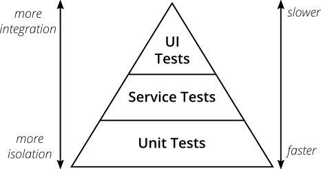

# Réflexion sur les tests à créer dans le cadre de ce projet

## Qu'est-ce qu'un test unitaire ?

Un test unitaire est un test qui va permettre de vérifier si une petite brique du projet fonctionne comme attendu. Par exemple pour ce projet on pourrait réaliser un test unitaire sur la fonction `add` de `calculator.js` qui est la suivante :
```js
export function add(number1, number2) {
  return number1 + number2;
}
```
On pourrait vérifier que `add(2,3)` retourne bien la somme de 2 + 3.

Durant ces tests les fonctions testées sont isolées du reste de l'application, on ne va réellement tester que la brique seule, pas comment elle va jouer un rôle structurel dans l'application.

## Qu'est-ce qu'un test d'intégration ?

Un test d'intégration est un niveau de test au-dessus du test unitaire, il va tester une fonctionnalité entière du projet en vérifiant que plusieurs parties fonctionnent correctement ensemble.
Ici on va tester l'interaction entre les modules, donc nos différentes briques d'application, on n'est donc plus dans un système fermé comme pour les tests unitaires mais dans un milieu contrôlé avec uniquement les dépendances nécessaires.


## Quand préférer un test d'intégration à un test unitaire ?

Un test d'intégration prend plus de temps (à écrire mais aussi à exécuter) qu'un test unitaire. Il ne remplace donc pas les tests unitaires, mais vient en complément de ces derniers afin de valider le bon fonctionnement global d'une fonctionnalité.

## Qu'est-ce qu'un test E2E et quel est son défaut principal ?

Les tests E2E, ou *end-to-end* soit de bout-en-bout en bon françois, sont des tests qui vont vérifier le fonctionnement **global** du projet avec une vision utilisateur final.
Ils testent donc l’application telle qu’elle est réellement utilisée, à la fois au niveau de l’interface utilisateur (clics sur les boutons, saisie dans les champs, navigation, etc.) et au niveau fonctionnel (les actions déclenchées produisent bien les résultats attendus).
Ces tests simulent des scénarii d'utilisation comme la complétion d'un formulaire d'inscription de bout en bout (d'où son nom).
Le principal défaut de ces tests sont leur durée qui peut vite devenir assez longue, mais sont aussi couteux et fragiles et vont donc nécessiter une maintenance soutenue de la part des développeurs.

## Si tu devais répartir 100 tests sur FinTrack, combien d’unitaires, combien d’intégrations, combien de E2E ? Justifie.

Il y a un schéma qui est assez connu, c'est la pyramide des tests que voici :

Source de l'image: https://martinfowler.com/articles/practical-test-pyramid.html 
D'après cette pyramide il faudrait avoir une répartition des tests avec le plus possible de tests unitaires, je proposerais donc 70% de tests unitaires soit **70** de ces tests, car ils sont rapides à mettre en place est assez stables dans le temps.
Viendraient ensuite les tests d'intégration pour tester l'interactions entre certains modules, déjà plus complexes à mettre en place il en faudrais peut-être 1/4 soit **25** tests d'intégrations.
Enfin les plus complets mais aussi les plus lourds à faire tourner et plus complexes à développer les tests E2E, il y en aurait donc **5** pour tester en profondeur les fonctionnalités clés de notre site.

La pyramide des tests ne définit pas de ratios chiffrés stricts. Les valeurs proposées ici constituent un ordre de grandeur cohérent avec les recommandations de Martin Fowler et les pratiques industrielles, adaptées au contexte du projet FinTrack. J'ai pu voir dans plusieurs sources une recommandation de 70/20/10, mais j'ai jugé que 10 tests E2E dans ce projet n'étaient pas utiles.